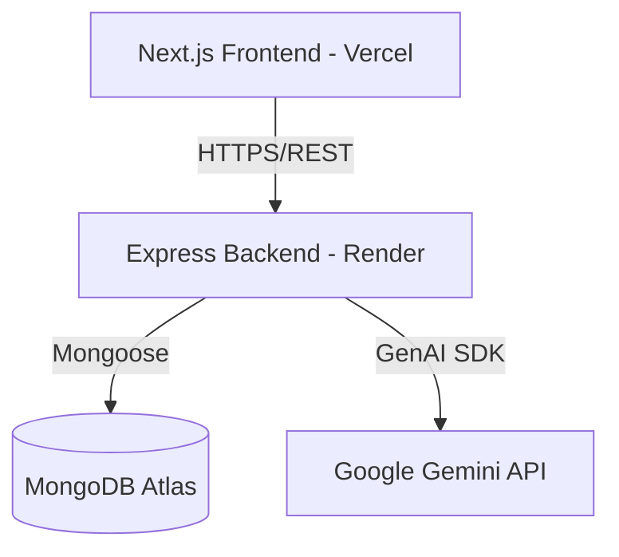

# DeveloperDash

A modern productivity dashboard built with Next.js, Node.js, Express, MongoDB, and Gemini AI.

## Architecture



## MongoDB Schema Overview

- **User**: Stores authentication and profile data (name, email, password, avatarUrl).
- **Project**: Represents a project container. References `User` (owner) and `teamMembers`. Contains `name`, `description`, `status`, `progress`, and `dueDate`.
- **Task**: Belongs to a `Project` and is optionally assigned to a `User`. Contains `title`, `description`, `status`, `priority`, and `dueDate`.

## Authentication Flow

1. **Registration**: User POSTs to `/api/auth/register` with name, email, password. Password hashed via bcrypt, user saved.
2. **Login**: User POSTs to `/api/auth/login`. Returns a JWT token.
3. **Session**: Frontend stores token in `localStorage`. 
4. **Protection**: Next.js uses `AuthProvider` to redirect unauthenticated users to `/login`. API uses `protect` middleware checking `Authorization: Bearer <token>`.

## API Documentation

### Auth
- `POST /api/auth/register` - Create account
- `POST /api/auth/login` - Authenticate & get token
- `GET /api/auth/me` - Get current user (protected)

### Projects (Protected)
- `GET /api/projects` - Get all user's projects
- `GET /api/projects/:id` - Get specific project
- `POST /api/projects` - Create project
- `PUT /api/projects/:id` - Update project
- `DELETE /api/projects/:id` - Delete project

### Tasks (Protected)
- `GET /api/tasks` - Get all tasks (supports query filtering)
- `GET /api/tasks/:id` - Get specific task
- `POST /api/tasks` - Create task
- `PUT /api/tasks/:id` - Update task
- `PATCH /api/tasks/:id/status` - Update task status
- `DELETE /api/tasks/:id` - Delete task

### AI Features (Protected)
- `POST /api/ai/generate-tasks` - Uses Gemini AI to analyze a project description and returns suggested tasks with priorities.

## AI Feature: Task Generator

The **AI Task Generator** utilizes the Google Gemini API to analyze a project's title and description. It automatically creates actionable tasks, complete with priority suggestions, and inserts them directly into the selected project.

- **Endpoint:** `POST /api/ai/generate-tasks`
- **Frontend Integration:** Accessible via the "AI Generate Tasks" button on the Tasks page.

## Deployment URLs

- **Frontend (Vercel):** (Requires your Vercel deployment URL)
- **Backend (Render):** `https://developerdash-api.onrender.com`

## Environment Variables

### Backend `.env`
```
PORT=5000
MONGODB_URI=mongodb+srv://<username>:<password>@cluster.mongodb.net/developerdash
JWT_SECRET=your_jwt_secret_here
GEMINI_API_KEY=your_gemini_api_key_here
```

### Frontend `.env`
```
NEXT_PUBLIC_API_URL=https://developerdash-api.onrender.com/api
```

## Build & Testing
- Backend: Built successfully with `tsc`. Tested API endpoints via Postman/local testing.
- Frontend: Built successfully with `next build`. Evaluated rendering, auth context, and UI functionality.
